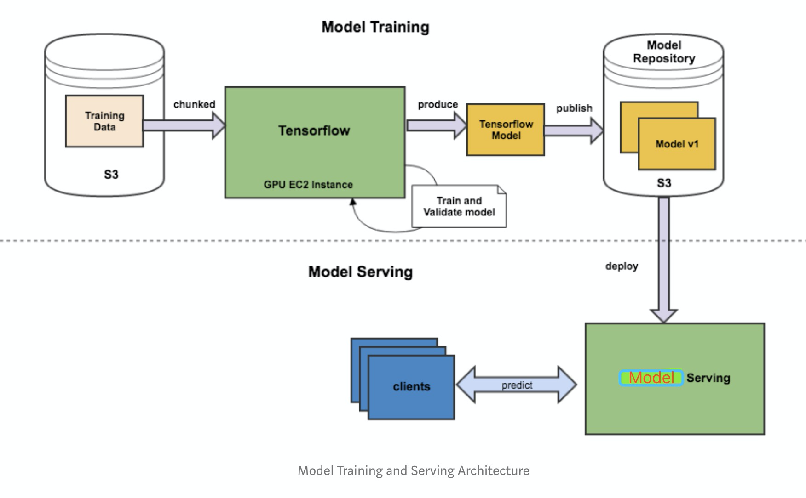
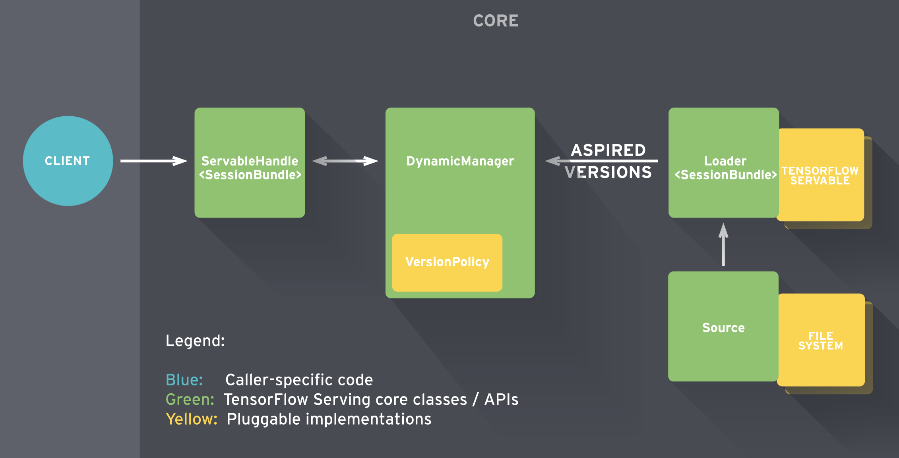

#  Tensorflow 模型线上部署

由于python的灵活性和完备的生态库，使得其成为实现、验证ML算法的不二之选。但是工业界要将模型部署到生产环境上，需要考略性能问题，就不建议再使用python端的服务。这个从训练到部署的整个流程如下图所示：



基本可以把工作分为三块：

> 1. Saver端 模型的离线训练与导出
> 2. Serving端 模型加载与在线预测
> 3. Client端 构建请求

本文采用  **Saver (python) + Serving (tensorflow serving) + Client (Java)**  作为解决方案，从零开始记录线上模型部署流程。 


## ***1、Saver***

部署模型第一步是将训练好的整个模型导出为一系列标准格式的文件，然后即可在不同的平台上部署模型文件。TensorFlow 使用 SavedModel（pb文件） 这一格式用于模型部署。与Checkpoint 不同，SavedModel 包含了一个 TensorFlow 程序的完整信息： 不仅包含参数的权值，还包含计算图。

SavedModel最终保存结果包含两部分saved_model.pb和variables文件夹。


此处分别介绍，Tensorflow 1.0 和 2.0两个版本的导出方法。

### ***1.1 Tensorflow 1.0 export***

[参考链接](https://github.com/tensorflow/tensorflow/blob/master/tensorflow/python/saved_model/README.md)

个人认为官方文档对具体使用写得不是特别明白，不想看官方文档的同学，可以对着示例照葫芦画瓢。其实也很简单，就两件事：

> Step 1、创建 **[SignatureDefs](https://github.com/tensorflow/serving/blob/master/tensorflow_serving/g3doc/signature_defs.md)**
>
> Step 2、保存计算图和权重

```python
builder = tf.saved_model.builder.SavedModelBuilder("out_dir")

# define signature which specify input and out nodes
predict_sig_def = (saved_model.signature_def_utils.build_signature_def(
inputs={"input_x":saved_model.build_tensor_info(fast_model.input_x)},
outputs={"out_y": saved_model.build_tensor_info(fast_model.y_pred_cls),
         "score": saved_model.build_tensor_info(fast_model.logits)},
         method_name=saved_model.signature_constants.PREDICT_METHOD_NAME))

# add graph and variables
builder.add_meta_graph_and_variables(sess, ["serve"],
                                     signature_def_map={"fastText_sig_def": predict_sig_def},
                                     main_op=tf.compat.v1.tables_initializer(),
                                     strip_default_attrs=True)
builder.save()
```

需要注意的是，此处保存时的signature、input、out的相关属性诸如：

> 1. name(自定义，不用和图内节点名称相同)
> 2. shape
> 3. data type

应与Client端传参对应。

### ***1.2 Tensorflow 2.0 export***

[参考链接](https://tf.wiki/zh/deployment/export.html)

Keras 模型均可方便地导出为 SavedModel 格式。不过需要注意的是，因为 SavedModel 基于计算图，所以对于使用继承 `tf.keras.Model` 类建立的 Keras 模型，其需要导出到 SavedModel 格式的方法（比如 `call` ）都需要使用 `@tf.function` 修饰。

```python
class MLP(tf.keras.Model):
    def __init__(self):
        super().__init__()
        self.flatten = tf.keras.layers.Flatten()
        self.dense1 = tf.keras.layers.Dense(units=100, activation=tf.nn.relu)
        self.dense2 = tf.keras.layers.Dense(units=10)

    @tf.function
    def call(self, inputs):         # [batch_size, 28, 28, 1]
        x = self.flatten(inputs)    # [batch_size, 784]
        x = self.dense1(x)          # [batch_size, 100]
        x = self.dense2(x)          # [batch_size, 10]
        output = tf.nn.softmax(x)
        return output

model = MLP()
```

然后使用下面的代码即可将模型导出为 SavedModel

```python
tf.saved_model.save(model, "保存的目标文件夹名称")
```

### ***1.3 check SavedModel***

如果想要检查保存的模型的SignatureDef、Inputs、Outputs等信息，可在cmd下使用命令：

```shell
saved_model_cli show --dir model_dir_path --all
```


## ***2、Serving***

模型保存好，就到Serving端的加载与预测步骤了。在介绍Tensorflow Serving之前，先介绍下基于 Tensorflow Java lib 的解决方案。

### ***2.1 Tensorflow Java lib***

[参考链接](https://zhuanlan.zhihu.com/p/55600911)

Tensorflow提供了一个Java API（本质上是Java封装了C++的动态库）, 允许在Java可以很方便的加载SavedModel, 并调用模型推理。

#### ***2.1.1 添加依赖***

首先，在maven的pom.xml中添加依赖，此处tensorflow的版本最好与python训练版本一致。

```xml
<dependency>
  <groupId>org.tensorflow</groupId>
  <artifactId>tensorflow</artifactId>
  <version>1.11.0</version>
</dependency>
```

#### ***2.1.2 Load & Predict***

然后，加载模型，调用模型在线预测。以fast text模型为例，代码如下：

```java
package model;

import org.tensorflow.SavedModelBundle;
import org.tensorflow.Session;
import org.tensorflow.Graph;
import org.tensorflow.Tensor;

public class FastTextModel {
  SavedModelBundle tensorflowModelBundle;
  Session tensorflowSession;

  void load(String modelPath){
    this.tensorflowModelBundle = SavedModelBundle.load(modelPath, "serve");
    this.tensorflowSession = tensorflowModelBundle.session();
  }

  public Tensor predict(Tensor tensorInput){
    // feed()传参类似python端的feed_dict
    // fetch()指定输出节点的名称
    Tensor output = this.tensorflowSession.runner().feed("input_x", tensorInput).fetch("out_y").run().get(0);

    return output;
  }

  public static void main(String[] args){
	 // 创建输入tensor, 注意type、shape应和训练时一致
    int[][] testvec = new int[1][100];
    for(int i=0; i<100; i++){
      testvec[0][i] = i;
    }
    Tensor input = Tensor.create(testvec);

	 // load 模型
    FastTextModel myModel = new FastTextModel();
    String modelPath = "Your model path";
    myModel.load(modelPath);

	 // 模型推理，注意resultValues的type、shape
    Tensor out = myModel.predict(input);
    float[][] resultValues = (float[][]) out.copyTo(new float[1][10]);
    // 防止内存泄漏，释放tensor内存
    input.close();
    out.close();
	 // 结果输出
    for(int i=0; i< 10; i++) {
      System.out.println(resultValues[0][i]);
    }
  }
}
```

#### ***2.1.3 Pros & Cons***

初步验证，Java 端和 Python 端调用模型推理，结果一致，可以满足基本使用。笔者并未进行严谨的测试，所以也谈不上踩坑，记录下想法。

***适用场景***

> 1. 需求简单，人力成本有限（一锤子买卖）
>
> 2. 网络限制，不易搭建Tensorflow Serving

***可能存在的问题***

> 1. 优化少，效率未必高
> 2. Java 封装 C++ 动态库，有些变量需要手动释放，若使用不当，可能出现***内存泄漏***
> 3. 无开箱即用的版本管理、并发处理等功能
> 4. API 不在 Tensorflow稳定性保障范围内
> 5. 资料匮乏，google投入的维护少

### ***2.2 Tensorflow Serving***

[参考链接](https://tensorflow.google.cn/tfx/guide/serving)

Tensorflow Serving 是google为机器学习模型生产环境部署设计的高性能的服务系统。具有以下特性：

> 1. 支持模型版本控制和回滚
> 2. 支持并发与GPU加速，实现高吞吐量
> 3. 开箱即用，并且可定制化
> 4. 支持多模型服务
> 5. 支持 gRPC/ REST API 调用 
> 6. 支持批处理
> 7. 支持热更新
> 8. 支持分布式模型
> 9. 支持多平台模型，如 TensorFlow/MXNet/PyTorch/Caffe2/CNTK等

Tensorflow Serving 丰富的、开箱即用的功能，使得其成为业内认可的部署方案。

Tensorflow Serving 内部的工作流如下图所示。



简单的说：

> 1. Sources 创建 Servable(可理解为计算图)的 Loader
> 2. Loader 传递版本号给 Manager 由其决定是否加载，同时 Manger 负责管理 Servable 并响应 Client的请求

详情见：[参考链接](https://tensorflow.google.cn/tfx/serving/architecture)

相比方案一，Tensorflow Serving要做的事情要多一点，但长远来看收益也更高。从零开始的话，大概要经过如下步骤：

> 1. Tensorflow serving环境搭建
> 2. 部署模型
> 3. 解决Client依赖
> 4. Client代码编写

#### ***2.2.1 环境搭建***

[参考链接](https://tensorflow.google.cn/tfx/serving/docker)

推荐基于Docker的方式搭建Tensorflow Serving, 未安装Docker的小伙伴请移步[Docker官网](https://www.docker.com/)，关于Docker的安装、使用网上资料一大堆，不在此赘述。

Docker安装完毕后，拉取tensorflow/serving的镜像。

```shell
docker pull tensorflow/serving
```

利用镜像,  新建服务实例，说明见2.2.2节。

```shell
docker run -p 8500:8500 -p 8501:8501 --mount \  type=bind,source=/path/to/my_model/,target=/models/my_model \  -e MODEL_NAME=my_model -t tensorflow/serving 
```

这里直接给出官网示例，运行正常则说明环境搭建完成。

```shell
# Download the TensorFlow Serving Docker image and repo
docker pull tensorflow/serving

git clone https://github.com/tensorflow/serving
# Location of demo models
TESTDATA="$(pwd)/serving/tensorflow_serving/servables/tensorflow/testdata"

# Start TensorFlow Serving container and open the REST API port
docker run -t --rm -p 8501:8501 -v \ "$TESTDATA/saved_model_half_plus_two_cpu:/models/half_plus_two" -e MODEL_NAME=half_plus_two tensorflow/serving &

# Query the model using the predict API
curl -d '{"instances": [1.0, 2.0, 5.0]}' \
    -X POST http://localhost:8501/v1/models/half_plus_two:predict

# Returns => { "predictions": [2.5, 3.0, 4.5] }
```

GPU版Tensorflow Serving 的环境搭建见[参考链接](https://tensorflow.google.cn/tfx/serving/docker)。

#### ***2.2.2 部署模型***

可以使用2.2.1节的指令部署单个模型，也可以通过 config 部署多模型，部署指令示例：

```shell
docker run -p 8500:8500 -p 8501:8501 --mount type=bind,source=/tmp/multi_models/,target=/models/multi_models -t tensorflow/serving \ 
--model_config_file=/models/multi_models/model.config
```

说明一下：

> 1. Serving 镜像支持 gRPC（端口8500）、RESTful API （端口8501）两种方式调用，使用时需要将host的端口与之绑定
> 2. Serving 无法直接加载 host 下的模型文件，所以需要将其映射到容器内路径，`MODEL_BASE_PATH` 默认为 `/models`
> 3. 多模型加载和模型版本管理在 model_config_file 中配置

这里给出我的 model.config 内容示例：

```
model_config_list:{
  config:{
    name:"textCnn",
    base_path:"/models/multi_models/textCnn/pb",
    model_platform:"tensorflow",
    model_version_policy {
      specific {
        versions: 0
      }
    }
  },

  config:{
    name:"rcnn",
    base_path:"/models/multi_models/rcnn/pb",
    model_platform:"tensorflow",
    model_version_policy {
      specific {
        versions: 0
      }
    }
  },

  config:{
    name:"bert",
    base_path:"/models/multi_models/bert/pb",
    model_platform:"tensorflow",
  }
}
```

这里 load 了三个模型（textCnn、rcnn、bert）, 每个模型维护自己的config，当一个模型存在多个版本时，tensorflow serving 默认加载版本号最高的版本，若想要指定版本加载，配置 model_version_policy 内容即可。

注意， base_path 是映射到 Docker容器内的路径，而不是本地路径。

#### ***2.2.3 更多功能***

以上是Tensorflow Serving 基本功能的介绍，其他功能诸如：自定义API、与Kubernetes的结合等操作，请见 [参考链接](https://www.tensorflow.org/tfx/serving/serving_kubernetes)。


## ***3、Client***

在上一节中说到 Tensorflow Serving 支持 RESTful 和 gRPC 两种API。若使用 RESTful API 调用，相关协议请见[参考链接](https://www.tensorflow.org/tfx/serving/api_rest)。

本文着重介绍 ***gRPC***的调用方法， Tensorflow Serving 的 ***gRPC API*** 在 protobuf 文件中定义，一般需要将其编译成相应的 Client 源码，再集成至应用。

### ***3.1 解决依赖***

若使用 Python 作为 Client ,  安装对应包即可：

```shell
pip install tensorflow-serving-api
```

若使用 Java 作为 Client，则需要编译 proto 文件，好处是用户可以编译自定义的API。编译流程参考了[前人文档](https://github.com/junwan01/tensorflow-serve-client)，此外还有一些要注意的点，见下文。

#### ***3.1.1 获取 protobuf 文件***

第一个注意点就是版本问题，因为由 .proto 文件编译出来的 java class 依赖 tensorflow的 jar 包，可能存在不兼容问题。

ok! 下载tensorflow的工程文件：

```shell
$ export SRC=~/Documents/source_code/
$ mkdir -p $SRC

$ cd $SRC
$ git clone git@github.com:tensorflow/serving.git
$ cd serving
$ git checkout tags/2.1.0

# another repo
$ cd $SRC
$ git clone git@github.com:tensorflow/tensorflow.git
$ cd tensorflow
$ git checkout tags/v2.1.0
```

将需要的proto文件复制到 Java 工程下：

```shell
$ export PROJECT_ROOT=$SRC/tensorflow-serve-client
$ mkdir -p $PROJECT_ROOT/src/main/proto/
$ rsync -arv  --prune-empty-dirs --include="*/" --include='*.proto' --exclude='*' $SRC/serving/tensorflow_serving  $PROJECT_ROOT/src/main/proto/
$ rsync -arv  --prune-empty-dirs --include="*/" --include="tensorflow/core/lib/core/*.proto" --include='tensorflow/core/framework/*.proto' --include="tensorflow/core/example/*.proto" --include="tensorflow/core/protobuf/*.proto" --exclude='*' $SRC/tensorflow/tensorflow  $PROJECT_ROOT/src/main/proto/
```

#### ***3.1.2 生成 Java 源码***

首先向maven项目中添加依赖：

```xml
<properties>
    <grpc.version>1.20.0</grpc.version>
</properties>

<dependencies>
    <dependency>
        <groupId>com.google.protobuf</groupId>
        <artifactId>protobuf-java</artifactId>
        <version>3.11.4</version>
    </dependency>
    <!-- gRPC protobuf client -->
    <dependency>
        <groupId>io.grpc</groupId>
        <artifactId>grpc-protobuf</artifactId>
        <version>1.28.0</version>
    </dependency>
    <dependency>
        <groupId>io.grpc</groupId>
        <artifactId>grpc-stub</artifactId>
        <version>1.28.0</version>
    </dependency>
    <dependency>
        <groupId>io.grpc</groupId>
        <artifactId>grpc-netty-shaded</artifactId>
        <version>1.28.0</version>
    </dependency>
</dependencies>
```
安装 protoc 工具，以笔者的mbp为例：

```shell
$ brew install protobuf
```

开始编译protobuf文件，有两种方法可选择，通过插件编译或者手动编译。

##### ***3.1.2.1 maven编译***

向maven中添加编译插件（注意版本）：

```xml
    <build>
        <plugins>
            <!--protocol buffers plugin -->
            <plugin>
                <groupId>org.apache.maven.plugins</groupId>
                <artifactId>maven-compiler-plugin</artifactId>
                <version>3.8.1</version>
                <configuration>
                    <source>1.6</source>
                    <target>1.6</target>
                    <!--<useArgumentFile>true</useArgumentFile>-->
                </configuration>
            </plugin>
            <plugin>
                <groupId>org.xolstice.maven.plugins</groupId>
                <artifactId>protobuf-maven-plugin</artifactId>
                <version>0.6.1</version>
                <configuration>
                    <protocExecutable>/usr/local/bin/protoc</protocExecutable>
                </configuration>
                <executions>
                    <execution>
                        <goals>
                            <goal>compile</goal>
                            <goal>compile-custom</goal>
                        </goals>
                    </execution>
                </executions>
            </plugin>
        </plugins>
    </build>

```

插件下载完毕后，运行指令，将项目下的 `*.proto`编译为 Java 代码：

```shell
$ mvn protobuf:compile
```

编译完成之后，在 $PROJECT_ROOT/src/main/resources 下会增加一个名为new_old的文件夹，将里面的 ./org/tensorflow 和 ./tensorflow/serving 两个文件夹移动至PROJECT_ROOT/src/main/java下即可。

##### ***3.1.2.2 手动编译***

手动编译相较前者麻烦些，但是可以编译出静态的代码集成至工程中，而不是每次运行都动态生成。

获取 [grpc-java repo](https://github.com/grpc/grpc-java) 代码，建立插件：

```shell
$ cd $SRC
$ git clone https://github.com/grpc/grpc-java.git
Cloning into 'grpc-java'...
remote: Enumerating objects: 166, done.
remote: Counting objects: 100% (166/166), done.
remote: Compressing objects: 100% (121/121), done.
remote: Total 84096 (delta 66), reused 92 (delta 25), pack-reused 83930
Receiving objects: 100% (84096/84096), 31.18 MiB | 23.14 MiB/s, done.
Resolving deltas: 100% (38843/38843), done.

$ cd grpc-java/compiler/
$ ../gradlew java_pluginExecutable
$ ls -l build/exe/java_plugin/protoc-gen-grpc-java
```

运行shell脚本，编译protobuf文件，脚本与前人略有不同，将路径稍作修改，运行即可：

```shell
export SRC=~/code/TFS_source/
export PROJECT_ROOT=~/Desktop/pingan/code/model-load/java/NluEngine/
cd $PROJECT_ROOT/src/main/proto/
protoc --java_out $PROJECT_ROOT/src/main/java --proto_path ./ ./tensorflow/core/example/*.proto
# append by wangxiao
protoc --java_out $PROJECT_ROOT/src/main/java --proto_path ./ ./tensorflow_serving/core/logging.proto
protoc --java_out $PROJECT_ROOT/src/main/java --proto_path ./ ./tensorflow/stream_executor/dnn.proto

protoc --java_out $PROJECT_ROOT/src/main/java --proto_path ./ ./tensorflow_serving/apis/*.proto
protoc --java_out $PROJECT_ROOT/src/main/java --proto_path ./ ./tensorflow_serving/config/*.proto
protoc --java_out $PROJECT_ROOT/src/main/java --proto_path ./ ./tensorflow_serving/util/*.proto
protoc --java_out $PROJECT_ROOT/src/main/java --proto_path ./ ./tensorflow_serving/sources/storage_path/*.proto

# the following 3 cmds will generate extra *Grpc.java stub source files in addition to the regular protobuf Java source files.
# The output grpc-java files are put in the same directory as the regular java source files.
# note the --plugin option uses the grpc-java plugin file we created in step 1.
protoc --java_out $PROJECT_ROOT/src/main/java --proto_path ./ ./tensorflow/core/protobuf/*.proto
protoc --java_out $PROJECT_ROOT/src/main/java --proto_path ./ ./tensorflow/core/lib/core/*.proto
protoc --java_out $PROJECT_ROOT/src/main/java --proto_path ./ ./tensorflow/core/framework/*.proto

protoc --grpc-java_out $PROJECT_ROOT/src/main/java --java_out $PROJECT_ROOT/src/main/java --proto_path ./ tensorflow_serving/apis/prediction_service.proto --plugin=protoc-gen-grpc-java=$SRC/grpc-java/compiler/build/exe/java_plugin/protoc-gen-grpc-java
protoc --grpc-java_out $PROJECT_ROOT/src/main/java --java_out $PROJECT_ROOT/src/main/java --proto_path ./ tensorflow_serving/apis/model_service.proto --plugin=protoc-gen-grpc-java=$SRC/grpc-java/compiler/build/exe/java_plugin/protoc-gen-grpc-java
protoc --grpc-java_out $PROJECT_ROOT/src/main/java --java_out $PROJECT_ROOT/src/main/java --proto_path ./ tensorflow_serving/apis/session_service.proto --plugin=protoc-gen-grpc-java=$SRC/grpc-java/compiler/build/exe/java_plugin/protoc-gen-grpc-java
```

运行正常的情况下，$PROJECT_ROOT/src/main/java/ 文件家里应该多了 /org/tensorflow 和 /tensorflow/serving 两个文件夹，至此，编译结束！

### ***3.2 Client编写***

分别给出 Python 和 Java Client 的简单示例。

#### ***3.2.1 Python client***

```python
from __future__ import print_function
import argparse
import numpy as np
import time
tt = time.time()

import cv2
import tensorflow as tf

from grpc.beta import implementations
from tensorflow_serving.apis import predict_pb2
from tensorflow_serving.apis import prediction_service_pb2

parser = argparse.ArgumentParser(description='incetion grpc client flags.')
parser.add_argument('--host', default='0.0.0.0', help='inception serving host')
parser.add_argument('--port', default='9000', help='inception serving port')
parser.add_argument('--image', default='', help='path to JPEG image file')
FLAGS = parser.parse_args()

def main():  
  # create prediction service client stub
  channel = implementations.insecure_channel(FLAGS.host, int(FLAGS.port))
  stub = prediction_service_pb2.beta_create_PredictionService_stub(channel)

  # create request
  request = predict_pb2.PredictRequest()
  request.model_spec.name = 'resnet'
  request.model_spec.signature_name = 'serving_default'

  # read image into numpy array
  img = cv2.imread(FLAGS.image).astype(np.float32)

  # convert to tensor proto and make request
  # shape is in NHWC (num_samples x height x width x channels) format
  tensor = tf.contrib.util.make_tensor_proto(img, shape=[1]+list(img.shape))
  request.inputs['input'].CopyFrom(tensor)
  resp = stub.Predict(request, 30.0)

  print('total time: {}s'.format(time.time() - tt))

```

#### ***3.2.2 Java Client***

```java
package client;

import io.grpc.ManagedChannel;
import io.grpc.ManagedChannelBuilder;
import tensorflow.serving.Model;
import org.tensorflow.framework.DataType;
import org.tensorflow.framework.TensorProto;
import org.tensorflow.framework.TensorShapeProto;

import tensorflow.serving.Predict;
import tensorflow.serving.PredictionServiceGrpc;

import java.util.ArrayList;
import java.util.List;


public class FastTextTFSClient {

    /**
     * @param args
     * @throws Exception
     */
    public static void main(String[] args) throws Exception {
        String host = "127.0.0.1";
        int port = 8500;
        // the model's name.
        String modelName = "fastText";
        int seqLen = 50;

        // assume this model takes input of free text, and make some sentiment prediction.
        List<Integer> intData = new ArrayList<Integer>();
        for(int i=0; i < seqLen; i++){
            intData.add(i);
        }

        // create a channel for gRPC
        ManagedChannel channel = ManagedChannelBuilder.forAddress(host, port).usePlaintext().build();
        PredictionServiceGrpc.PredictionServiceBlockingStub stub = PredictionServiceGrpc.newBlockingStub(channel);

        // create a modelspec
        Model.ModelSpec.Builder modelSpecBuilder = Model.ModelSpec.newBuilder();
        modelSpecBuilder.setName(modelName);
        modelSpecBuilder.setSignatureName("fastText_sig_def");

        Predict.PredictRequest.Builder builder = Predict.PredictRequest.newBuilder();
        builder.setModelSpec(modelSpecBuilder);

        // create the input TensorProto and request
        TensorProto.Builder tensorProtoBuilder = TensorProto.newBuilder();
        tensorProtoBuilder.setDtype(DataType.DT_INT32);
        for (Integer intDatum : intData) {
            tensorProtoBuilder.addIntVal(intDatum);
        }
        // build input TensorProto shape
        TensorShapeProto.Builder tensorShapeBuilder = TensorShapeProto.newBuilder();
        tensorShapeBuilder.addDim(TensorShapeProto.Dim.newBuilder().setSize(1));
        tensorShapeBuilder.addDim(TensorShapeProto.Dim.newBuilder().setSize(seqLen));
        tensorProtoBuilder.setTensorShape(tensorShapeBuilder.build());
      
        TensorProto tp = tensorProtoBuilder.build();
        builder.putInputs("input_x", tp);
        Predict.PredictRequest request = builder.build();
        
        // get response
        Predict.PredictResponse response = stub.predict(request);
    }
}
```


## ***4、Test***

### ***4.1 一致性测试***

笔者先后验证了 Text Cnn 和 base BERT 模型，分别用 Python 和 Tensorflow Serving 加载相同模型，输入10组不同数据，输出结果比对一致！

### ***4.2 性能测试***

以文本分类任务为例，这边一共训练了四个模型，基本覆盖了主流网络结构（Cnn/Rnn/Transformer）：

> 1. Fast text
> 2. Text Cnn
> 3. Rcnn (1 layer Bilstm + pooling)
> 4. BERT (12 layer)

此外，还针对单线程和多线程请求作了对比测试。

#### ***4.2.1 测试环境***

测试机器使用的是mbp-2019，Docker 资源配置：

| **Cpu**    | **Intel Core i5 - 2.4 GHz - 4 core** |
| ---------- | ------------------------------------ |
| **Memory** | **2 GB 2133MHz LPDDR3**              |
| **Swap**   | **1 GB**                             |

#### ***4.2.2测试结果***

在输入文本长度固定为 50 时，分别验证单线程和多线程性能，结果如下表。

|   model   | thread | Queries | total costs (s) | single costs (ms) |
| :-------: | :----: | :-----: | :-------------: | :---------------: |
| Fast text |   1    |  1000   |    1.804726     |     1.804726      |
| Fast text |   1    |  5000   |    9.322348     |     1.8644696     |
| Fast text |   10   |  1000   |    0.863049     |     0.863049      |
| Fast text |   10   |  5000   |    3.302042     |     0.6604084     |
| Text Cnn  |   1    |  1000   |    3.149949     |     3.149949      |
| Text Cnn  |   1    |  5000   |    11.433131    |     2.2866262     |
| Text Cnn  |   10   |  1000   |    1.054073     |     1.054073      |
| Text Cnn  |   10   |  5000   |    5.116928     |     1.0233856     |
|   Rcnn    |   1    |  1000   |    8.709985     |     8.709985      |
|   Rcnn    |   1    |  5000   |    41.316675    |     8.263335      |
|   Rcnn    |   10   |  1000   |    4.097872     |     4.097872      |
|   Rcnn    |   10   |  5000   |    21.650854    |     4.3301708     |
|   BERT    |   1    |   500   |    48.831417    |     97.662834     |
|   BERT    |   1    |  1000   |    99.502192    |     99.502192     |
|   BERT    |   10   |   500   |    30.662522    |     61.325044     |
|   BERT    |   10   |  1000   |    62.584200    |      62.5842      |

在输入文本长度固定为 100 时，分别验证单线程和多线程性能，结果如下表。

|   model   | thread | QUERIEs | total costs (s) | single costs (ms) |
| :-------: | :----: | :-----: | :-------------: | :---------------: |
| Fast text |   1    |  1000   |    2.294074     |     2.294074      |
| Fast text |   1    |  5000   |    9.183258     |     1.8366516     |
| Fast text |   10   |  1000   |    0.711471     |     0.711471      |
| Fast text |   10   |  5000   |    4.440220     |     0.888044      |
| Text Cnn  |   1    |  1000   |    2.905316     |     2.905316      |
| Text Cnn  |   1    |  5000   |    12.867391    |     2.5734782     |
| Text Cnn  |   10   |  1000   |    1.055177     |     1.055177      |
| Text Cnn  |   10   |  5000   |    5.400848     |     1.0801696     |
|   Rcnn    |   1    |  1000   |    17.621534    |     17.621534     |
|   Rcnn    |   1    |  5000   |    83.072520    |     16.614504     |
|   Rcnn    |   10   |  1000   |    6.960749     |     6.960749      |
|   Rcnn    |   10   |  5000   |    36.704266    |     7.3408532     |
|   BERT    |   1    |   500   |    74.752247    |    149.504494     |
|   BERT    |   1    |  1000   |   154.435726    |    154.435726     |
|   BERT    |   10   |   500   |    49.598261    |     99.196522     |
|   BERT    |   10   |  1000   |   101.888118    |    101.888118     |

输入长度为50时，可以看到 Cnn 类模型效率极高，即使是单层的BiLstm 也能在10ms以内完成预测。

而12层BERT单次预测竟然用了 100 ms!  NLP的小伙伴们也不用着急，个人认为仍有很多优化点：

> 1. 自己训练个小点的 BERT，如6层
> 2. 部署 GPU 版 Tensorflow Serving
> 3. 用BERT的加速版变体替代
> 4. 输入截断

此外，多线程Tensorflow Serving 内部对并发作了优化（batch操作），多线程请求明显快于单线程。

### ***4.3 测试结论***

> 1. Tensorflow Serving 的输出可靠；
> 2. Tensorflow Serving 运行效率极高，达到生产上线要求。

 